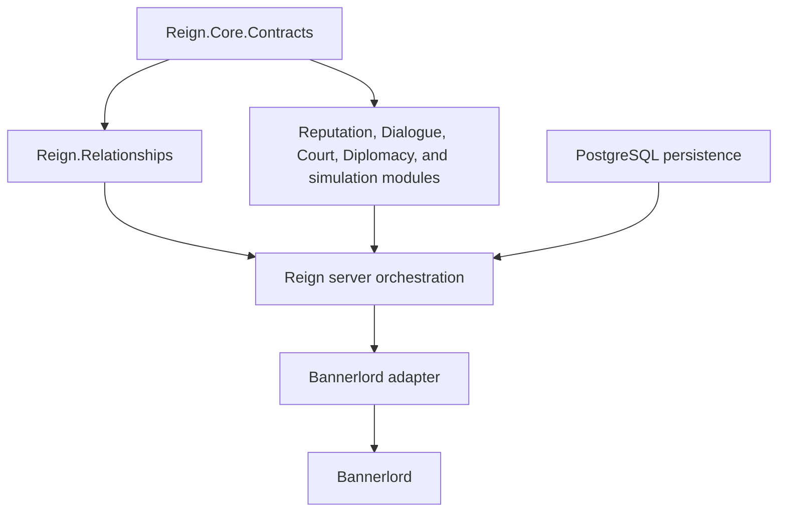

# Reign architecture for agents

Reign uses subsystem-owned source folders and contract-driven validation modules. The authoritative machine-readable view is `/reign.modules.json`; this document explains the intended direction and invariants.

## Boundary rules

- Domain modules do not reference TaleWorlds assemblies, server UI code, HTTP transport, or PostgreSQL clients.
- `Reign.Core.Contracts` contains only stable shared IDs, DTOs, events, interfaces, and invariant policies.
- The server owns orchestration and persistence adapters. Domain calculations should move out of it as they are touched.
- The Bannerlord project is an adapter: it translates TaleWorlds state into contracts and applies returned commands.
- PostgreSQL is the only production database. SQLite exists only in the explicit legacy importer tool.
- A public contract or persistent schema change is never an isolated change; validation must include consumers.

## Source organization

- Server implementation lives under `ReignBetaServer/src/Modules/<Subsystem>`.
- Bannerlord implementation lives under `ReignBeta/src/Modules/<Subsystem>`.
- Live-test harness code lives under `ReignBetaServer/ReignLiveTest/Features/<Subsystem>`.
- Feature-owned MCP tools and tests live under matching `ReignMcp/.../Modules/<Subsystem>` and `ReignMcp/tests/.../Features/<Subsystem>` folders.
- Namespaces and assembly boundaries remain stable; folders express ownership even when a subsystem has not yet been extracted into a pure library.
